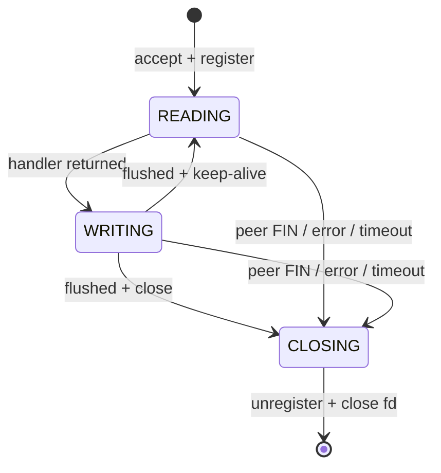
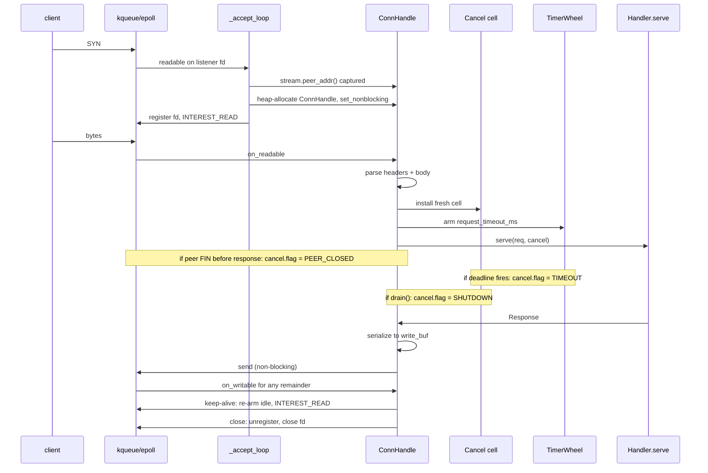

# Architecture

flare is a layered library. Each module imports only from the layers
below it. No circular dependencies, no global state, no hidden runtime.

```
flare.io       BufReader (Readable trait, generic buffered reader)
flare.ws       WebSocket client + server (RFC 6455)
flare.h2       HTTP/2 (planned: h2 over TLS only)
flare.http     HTTP/1.1 client + reactor server + Handler / Router / App
               + extractors + ComptimeRouter + StaticResponse
               + Cancel / CancelHandler
flare.tls      TLS 1.2/1.3 (OpenSSL); TlsAcceptor + ALPN
flare.tcp      TcpStream + TcpListener (IPv4 + IPv6)
flare.udp      UdpSocket (IPv4 + IPv6)
flare.dns      getaddrinfo (dual-stack)
flare.net      IpAddr, SocketAddr, RawSocket
flare.runtime  Reactor (kqueue/epoll), TimerWheel, Scheduler,
               num_cpus / default_worker_count, pthread + pinning,
               install_drain_on_sigterm
```

---

## Reactor + per-connection state machine

A single event loop per worker drives every connection. No
thread-per-connection. No locks on the hot path. The reactor wraps
`kqueue` on macOS and `epoll` on Linux through a thin abstraction
in [`flare/runtime/reactor.mojo`](../flare/runtime/reactor.mojo).

Each accepted connection owns a small state machine in
[`flare/http/_server_reactor_impl.mojo`](../flare/http/_server_reactor_impl.mojo):



The state machine **does not own** the reactor or the timer wheel. It
exposes `on_readable`, `on_writable`, and `on_timeout` and returns a
small `StepResult` per call telling the reactor how to update its
interest mask, whether to re-arm the idle timer, and whether the
connection is finished. The reactor owns the lifecycle.

A 3-cycle inline fast path in `run_reactor_loop` lets a single
readable event drive the next writable + the next readable in
sequence (without going back through `kqueue.kevent` / `epoll_wait`)
when the buffers permit. This is the single biggest win on the
plaintext keep-alive workload — the syscall overhead is the
dominant per-request cost on flare's hot path.

---

## Request lifecycle



The Cancel cell is a single byte (`0` = live, `1..3` = reason) that
the reactor flips before the handler's next `cancel.cancelled()` poll.
We do not preempt — Mojo can't, and synchronous preemption would
defeat the per-thread invariant. Cooperation is the contract.

---

## Multicore: thread-per-core via SO_REUSEPORT

`HttpServer.serve(handler, num_workers=N)` with `N >= 2` opens N
`SO_REUSEPORT` listeners on N pthread workers. Each worker owns its
own reactor, its own timer wheel, its own per-connection state.
**Shared-nothing.** The kernel load-balances accepted connections
across the listeners.

`pin_cores=True` (default) pins worker `i` to core `i % num_cpus()`
on Linux via `pthread_setaffinity_np`. macOS does not expose CPU
affinity to userspace, so pinning is a no-op there. The upper
bound on `num_workers` is 256, enforced by `Scheduler.start`.

`Scheduler.shutdown` and `Scheduler.drain(timeout_ms)` coordinate
across workers. Drain returns one `ShutdownReport` per worker.

---

## Timer wheel

[`flare/runtime/timer_wheel.mojo`](../flare/runtime/timer_wheel.mojo)
is a hashed timing wheel with millisecond resolution and a fixed
slot count. Inserts and cancels are O(1) amortised; `advance(now_ms)`
fires every expired entry in slot order. It's the single source of
truth for `idle_timeout_ms`, `write_timeout_ms`,
`read_body_timeout_ms`, `handler_timeout_ms`, and
`request_timeout_ms`.

Resolution: 1 ms tick, 1024 slots, fixed memory. Deadlines below
1 ms round up. This is well below the noise floor of any HTTP
deadline a real service cares about.

---

## What stays out of the reactor

flare deliberately keeps a few things on the application thread, not
the reactor thread:

- **TLS handshake.** Client handshake is inline on
  `TlsStream.connect`. The server-side `TlsAcceptor` exposes a
  blocking `handshake_fd(fd)` today; the non-blocking
  reactor-state-machine variant (advanced via the same
  `on_readable` / `on_writable` calls as HTTP) is a follow-up
  gated on a Mojo nightly improvement.
- **DNS resolution.** `getaddrinfo` is a blocking call; the
  client uses it pre-connect. The reactor never blocks on it.
- **Long-running handler work.** The contract is synchronous: a
  slow handler blocks its worker's reactor. The `Cancel` token
  ensures the *caller* doesn't pay for it (peer FIN, timeout,
  drain all flip the cell); the `block_in_pool` escape hatch is
  the documented way to push work off the reactor thread when a
  blocking call is unavoidable.

---

## Where to read the code

| Concern | Source |
|---|---|
| Reactor abstraction | [`flare/runtime/reactor.mojo`](../flare/runtime/reactor.mojo) |
| `kqueue` impl | [`flare/runtime/_kqueue.mojo`](../flare/runtime/_kqueue.mojo) |
| `epoll` impl | [`flare/runtime/_epoll.mojo`](../flare/runtime/_epoll.mojo) |
| Timer wheel | [`flare/runtime/timer_wheel.mojo`](../flare/runtime/timer_wheel.mojo) |
| Multicore scheduler | [`flare/runtime/scheduler.mojo`](../flare/runtime/scheduler.mojo) |
| HTTP request parsing | [`flare/http/server.mojo`](../flare/http/server.mojo) |
| HTTP per-conn state machine | [`flare/http/_server_reactor_impl.mojo`](../flare/http/_server_reactor_impl.mojo) |
| `Cancel` cell + `CancelHandler` | [`flare/http/cancel.mojo`](../flare/http/cancel.mojo) |
| Server-side TLS | [`flare/tls/acceptor.mojo`](../flare/tls/acceptor.mojo) |
| Streaming response bodies | [`flare/http/streaming.mojo`](../flare/http/streaming.mojo) |
| SIGTERM helper | [`flare/runtime/_signal.mojo`](../flare/runtime/_signal.mojo) |

If you want a one-page tour of each, the layered docstrings on the
public types (`HttpServer`, `Router`, `Handler`, `App`) are the place
to start; they include "Failure modes" sections describing what
raises, what becomes a 4xx vs 5xx, what gets logged, and what never
returns.
